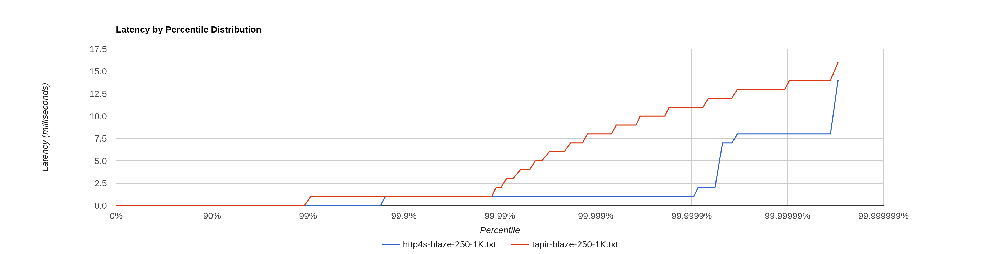
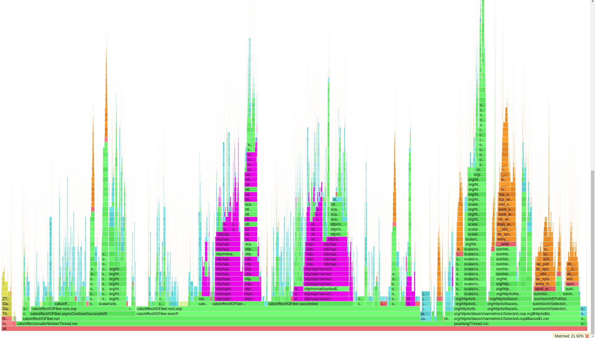

# Scala rest benchmark

## Test setup

Client and server run on two separate machines. Both share the same setup: 
 - Intel® Core™ i9-13900K CPU @ 3.0GHz (max 5.8GHz, performance-cores only), 
 - RAM 64GB DDR5-4800,
 - 10Gbit network,
 - Ubuntu 23.04 (Linux 6.2), 
 - Oracle GraalVM 23.0 for Java 20.

### Server

Server code resides in the `/server` module. Server exposes a single  GET `/ts` endpoint, 
which returns server Epoch clock.    

Tested servers:
 - [http4s] + blaze ([CE] 3.5.1, [fs2] 3.7.0)
 - [http4s] + blaze, via [tapir] ([CE] 3.5.1, [fs2] 3.7.0) 
 
### Client 

Client code resides in the `/client` module. [Gatling] client ramps up to 250k users within 30s,
and each user issues a `GET /ts` request at a rate 1000req/s.  
For each response, an absolute difference between the client timestamp and the timestamp received from the server
is stored into an [HdrHistogram]. With clocks synchronized between the client and server, this value corresponds
to the latency induced by the server.
 

### Clock synchronization

For precise measurement of latency up to milliseconds need to install, configure, and run `chrony` service.

The following command could be used for installation on Ubuntu:
```sh
sudo apt-get -y install chrony
```

Here is a list of NTP servers that is used in our `/etc/chrony/chrony.conf`:
```
        server time5.facebook.com iburst
       	server tempus1.gum.gov.pl
	server tempus2.gum.gov.pl
        server ntp1.tp.pl
        server ntp2.tp.pl 
```

For non-Poland regions [other servers could be preffered](https://gist.github.com/mutin-sa/eea1c396b1e610a2da1e5550d94b0453).

Finally need to restart the service after (re)configuration by:
```
sudo systemctl restart chrony
```

[Here](https://engineering.fb.com/2020/03/18/production-engineering/ntp-service/) is a great article about time synchronization in Facebook.

## Benchmarks

Benchmark results reside in `/results`.
```
 results
 ├── http4s-blaze      (CE 3.5.1, fs2 3.7.0)
 └── tapir-blaze       (CE 3.5.1, fs2 3.7.0, tapir 1.6.3)
```

Each folder contains:
- [HdrHistogram] latency,
- [Gatling] html report,
- [async-profiler] flame graphs in 2 flavours: per-thread and aggregated.

Quick summary:



It comes as no surprise that [tapir] ends up being a tad slower, due to the interpreter overhead. 
A more detailed insight is offered by the async-profiler results:



Tapir interpreter accounts for 22% of total CPU cycles.  

## Acknowledgements

The majority of the work behind the tests is carried out by [Andriy Plokhotnyuk](https://github.com/plokhotnyuk).
Thank, you Andriy!

[tapir]: https://github.com/softwaremill/tapir
[gatling]: https://github.com/gatling/gatling
[babl]: https://github.com/babl-ws/babl
[http4s]: https://github.com/http4s/http4s
[zio-http]: https://github.com/zio/zio-http
[zio]: https://github.com/zio/zio
[CE]: https://github.com/typelevel/cats-effect
[fs2]: https://github.com/typelevel/fs2
[HdrHistogram]: https://github.com/HdrHistogram/HdrHistogram
[async-profiler]: https://github.com/async-profiler/async-profiler
